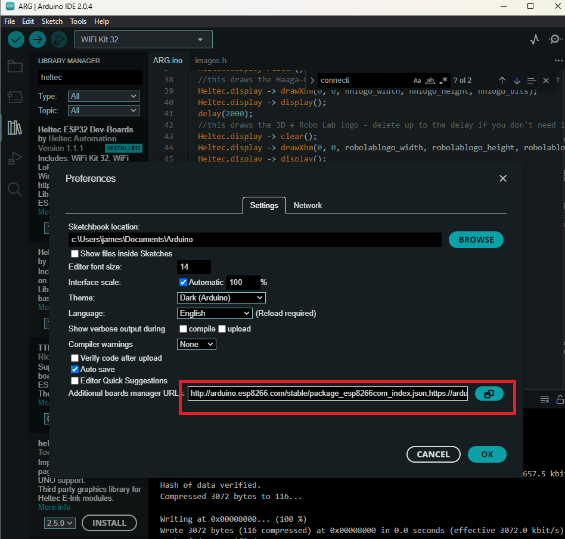

# Heltec ESP-32!

## Install & Setup

Install the Arduino IDE https://www.arduino.cc/en/software/

Configure it for ESP32, open the arduino IDE preferences menu

Paste the below in custom boards (one per each row)

http://arduino.esp8266.com/stable/package_esp8266com_index.json
https://arduino.esp8266.com/stable/package_esp8266com_index.json
https://github.com/Heltec-Aaron-Lee/WiFi_Kit_series/releases/download/0.0.5/package_heltec_esp32_index.json
https://raw.githubusercontent.com/SpacehuhnTech/arduino/main/package_spacehuhn_index.json

Install Dependancies - open manage libraries

Search for heltec and install the one shown below

Select WiFi Kit 32 in the boards option at the top

You can plug in the ESP32 now, you might need to choose a port 

If nothing happens/board doesn't show up in device manager, you may need to install their serial <-> USB driver here

https://docs.heltec.org/general/establish_serial_connection.html#for-windows

Once you plug it in and it shows up like this in the Arduino IDE menu, you're good to go

Open up a few of the projects in the examples folder, or have a look around on github for ESP32 Arduino PRojects and see what you can get working!

Happy Hacking

